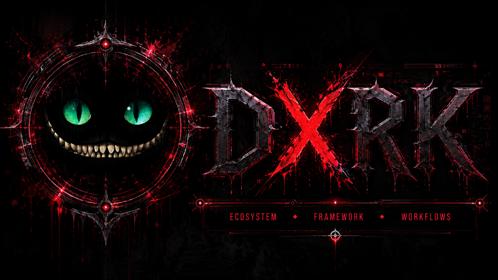

<div align="center">



# Dxrk

**Ecosistema, Frameworks y Workflows para agentes de IA.**

[](https://github.com/Dxrk777/Dxrk-Ai/releases)
[](LICENSE)


</div>

---

## Que es Dxrk

Dxrk potencia cualquier agente de IA con memoria persistente, workflows de Spec-Driven Development, skills curados, servidores MCP, un conmutador de proveedores de IA, y asignacion de modelos por fase.

**Antes**: Instalaste un agente de IA pero es solo un chatbot.

**Despues**: Tu agente tiene memoria, skills, workflow, herramientas MCP y una persona configurada.

### 13 Agentes Soportados

| Agente               | Modelo de Delegacion         | Caracteristica Principal                                    |
| -------------------- | :--------------------------: | ---------------------------------------------------------- |
| **Claude Code**      | Completo (Task tool)         | Sub-agentes, estilos de salida                             |
| **OpenCode**         | Completo (overlay multi-modo)| Enrutamiento de modelos por fase                           |
| **Kilo Code**        | Completo (overlay multi-modo)| Config compatible en `~/.config/kilo`                      |
| **Gemini CLI**       | Completo (experimental)      | Agentes en `~/.gemini/agents/`                             |
| **Cursor**           | Completo (subagentes nativos)| 10 agentes SDD en `~/.cursor/agents/`                      |
| **VS Code Copilot**  | Completo (runSubagent)       | Ejecucion paralela                                         |
| **Codex**            | Solo-agente                  | CLI nativo, config TOML                                    |
| **Windsurf**         | Solo-agente                  | Plan Mode, Code Mode, workflows nativos                    |
| **Antigravity**      | Solo-agente + Mission Control| Sub-agentes de Browser/Terminal                            |
| **Kimi Code**        | Completo (agentes nativos)   | Plantillas en `~/.kimi`                                    |
| **Kiro IDE**         | Completo (subagentes nativos)| `~/.kiro/agents/` + orquestacion                           |
| **Qwen Code**        | Completo (sub-agentes)       | Comandos slash, `~/.qwen/commands/`                        |
| **Pi**               | Completo (subagentes)        | `dxrk-pi` con persona/modelo + memoria Dxrk-Memory         |

---

## Instalacion

### macOS / Linux

```bash
curl -fsSL https://raw.githubusercontent.com/Dxrk777/Dxrk-Ai/main/scripts/install.sh | bash
```

### Windows

```powershell
scoop bucket add dxrk https://github.com/Dxrk777/Dxrk-scoop-bucket
scoop install dxrk
```

### Go install

```bash
go install github.com/Dxrk777/Dxrk-Ai/cmd/dxrk@latest
```

---

## Configuracion por Proyecto

| Comando                       | Que hace                                                              |
| ----------------------------- | --------------------------------------------------------------------- |
| `/sdd-init`                   | Detecta stack, capacidades de testing, activa Modo TDD estricto      |
| `dxrk skill-registry refresh` | Escanea skills instaladas y convenciones del proyecto, construye registry |

---

## Caracteristicas Clave

### Perfiles SDD de OpenCode

Asigna diferentes modelos de IA a diferentes fases SDD:

```bash
dxrk sync --profile cheap:openrouter/qwen/qwen3-30b-a3b:free
dxrk sync --profile-phase cheap:sdd-design:anthropic/claude-sonnet-4-20250514
```

### Dxrk-Memory (Memoria Persistente)

Tu agente recuerda decisiones, bugs y contexto entre sesiones:

```bash
dxrk-memory projects list
dxrk-memory search "auth bug"
dxrk-memory tui
```

---

## Documentacion

| Tema                                              | Descripcion                                                  |
| ------------------------------------------------- | ------------------------------------------------------------ |
| [Uso Previsto](docs/intended-usage.md)            | Modelo mental de como usar Dxrk                              |
| [Agentes](docs/agents.md)                         | Agentes soportados, matriz de features                       |
| [Componentes y Presets](docs/components.md)       | Componentes, Dxrk-Guardian, skills y presets                 |
| [Arquitectura](docs/architecture.md)              | Layout del codigo fuente y testing                            |
| [Uso](docs/usage.md)                              | Modos de persona, TUI interactiva y flags CLI                |
| [Plataformas](docs/platforms.md)                  | Plataformas soportadas y notas de Windows                    |

---

## Contribuir

Ver [CONTRIBUTING.md](CONTRIBUTING.md) para guias de desarrollo.

---

<div align="center">

**DXRK // BEYOND LIMITS**

[](LICENSE)

</div>
